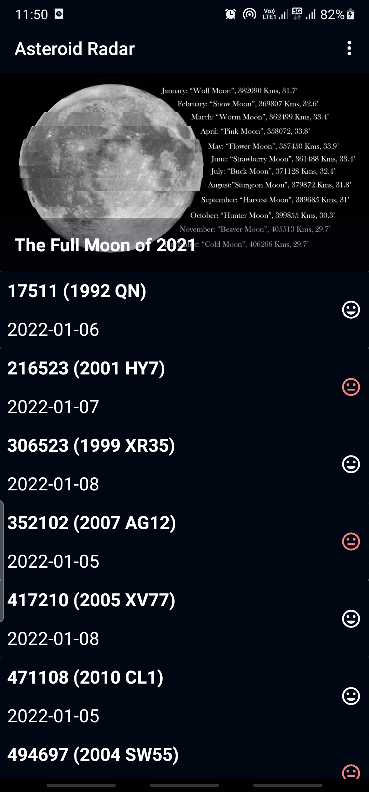
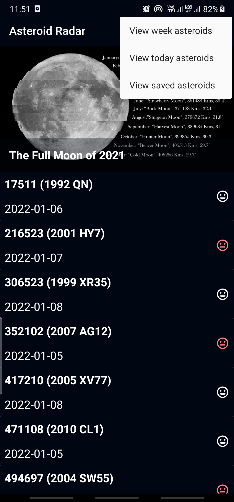
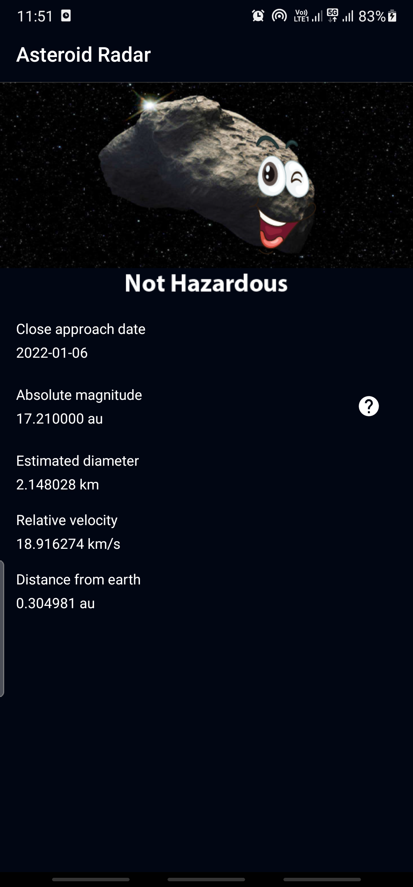
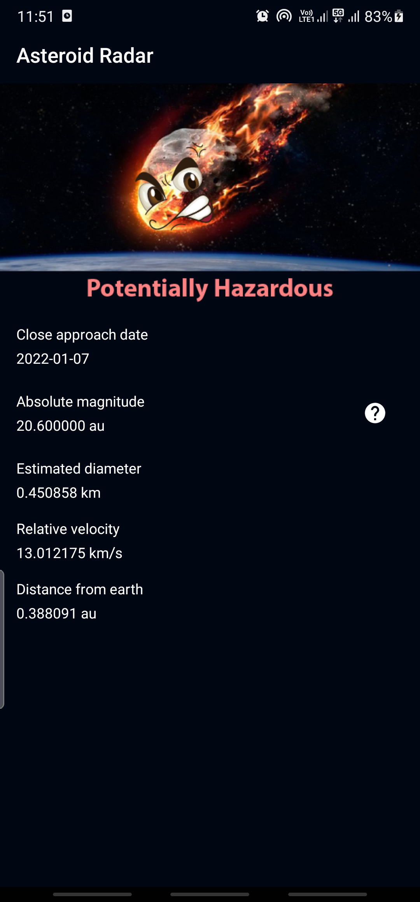

## Asteroid Radar

Asteroid Radar is application developed in Kotlin which connects to NASA's API web service to track incoming asteroids and sort them on a daily and weekly basis as well as display Astronomy Picture of the Day.

Asteroid Radar is an application built to demonstrate core Kotlin and Android Development skills.

The app utilizes the following libraries:

* [Retrofit](https://square.github.io/retrofit/) to make API calls to an HTTP web service.
* [Moshi](https://github.com/square/moshi) which handles the deserialization of the returned JSON to Kotlin data objects. 
* [Picasso](https://github.com/square/picasso) to load and cache images by URL.
* [Room](https://developer.android.com/training/data-storage/room) for local database storage.
* [Coroutines](https://kotlinlang.org/docs/coroutines-overview.html) for background-threading.
  
It leverages the following components from the Jetpack library:

* [ViewModel](https://developer.android.com/topic/libraries/architecture/viewmodel).
* [RecyclerView](https://developer.android.com/jetpack/androidx/releases/recyclerview).
* [LiveData](https://developer.android.com/topic/libraries/architecture/livedata).
* [Data Binding](https://developer.android.com/topic/libraries/data-binding/) with binding adapters.
* [Navigation](https://developer.android.com/topic/libraries/architecture/navigation/) with the SafeArgs plugin for parameter passing between fragments.

## Screenshots

  <table>
  <tr>
    <td></td>
    <td></td>
  </tr>
<tr>
    <td></td>
    <td></td>
</tr>
 </table>